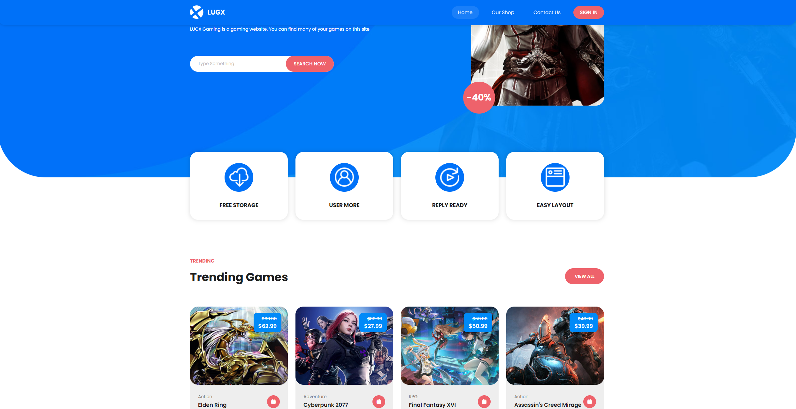
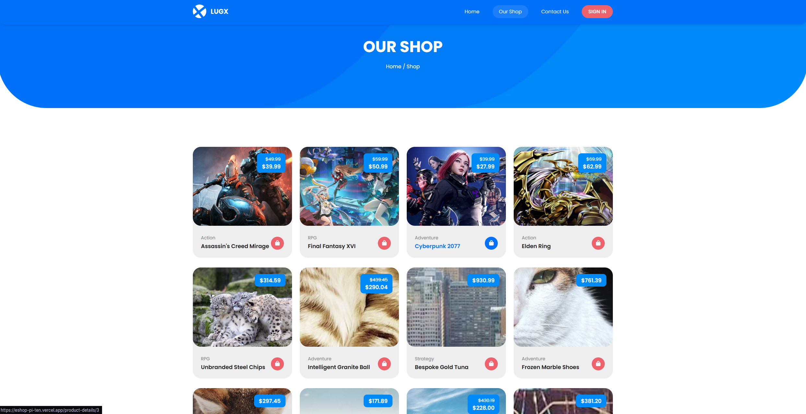
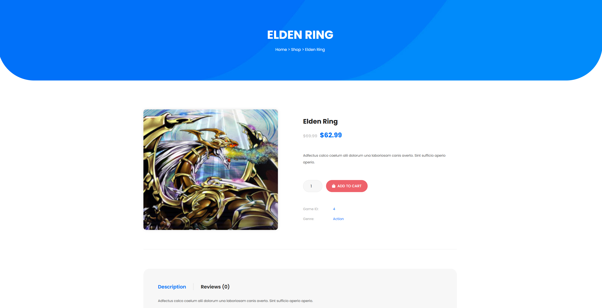
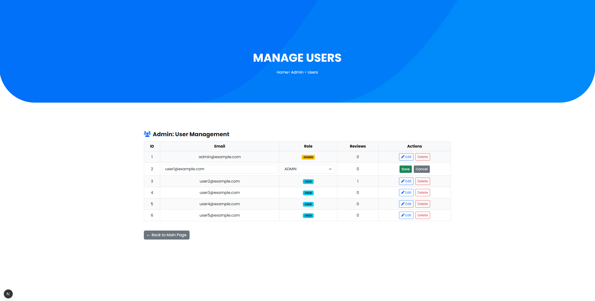
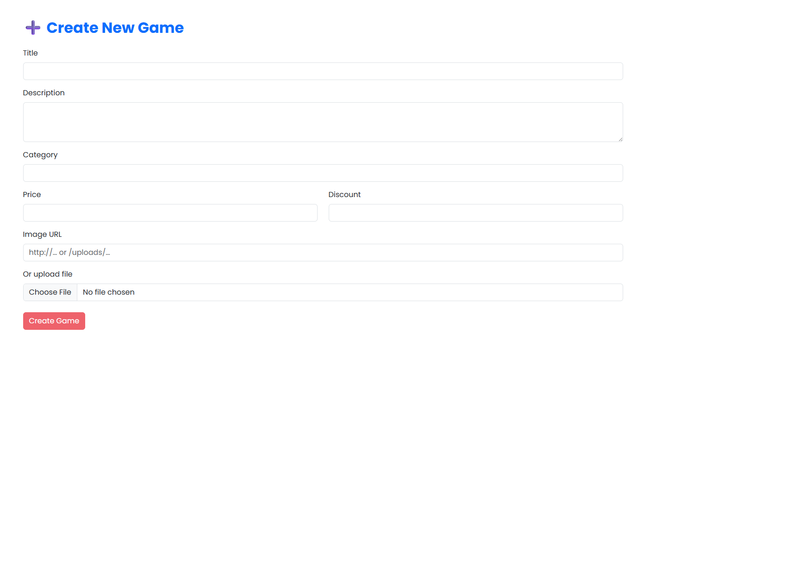
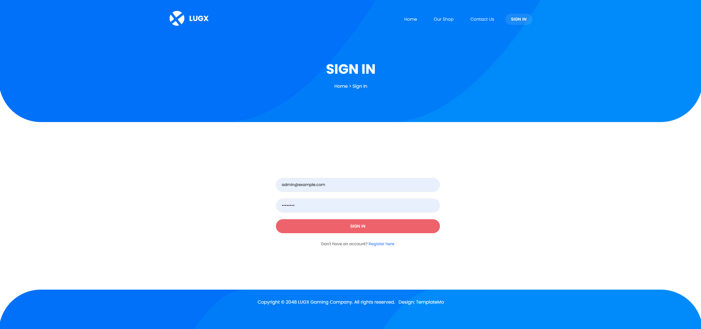
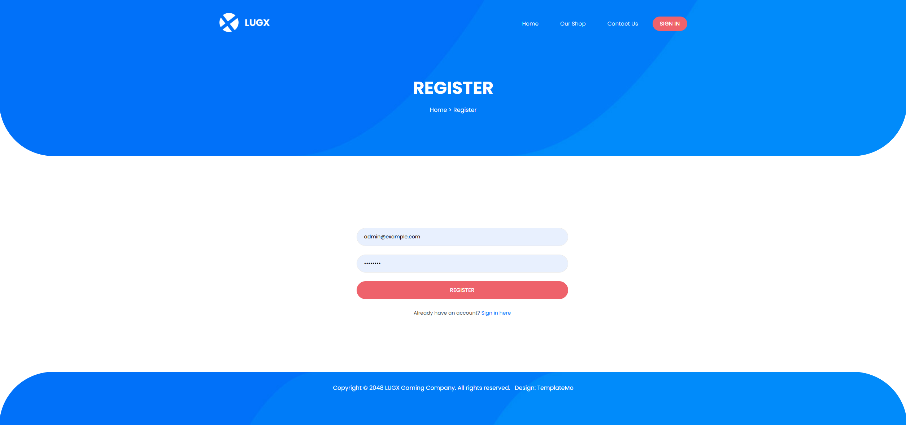

# Gaming Store Web Application

A full-stack gaming marketplace web application built with Next.js, Prisma ORM, PostgreSQL, and modern full-stack development practices.

The project includes authentication, role-based admin management, game reviews, image uploads, relational database integration, and dynamic game management functionality.

## Demo Environment

A live demo version of the project is deployed on Vercel.

The demo database contains seeded sample data for portfolio and testing purposes.

Please avoid using real personal information while testing the application.
https://eshop-pi-ten.vercel.app/

## GitHub Repository

https://github.com/SimonasAz/eshop

## Screenshots

### Homepage


### Shop Page


### Product Details & Reviews


### Admin Panel


### Create/Edit Game


### Login & Register



## Features

### User Features
- User registration and login
- Secure password hashing using bcrypt
- Browse gaming marketplace
- View trending and featured games
- Game review and rating system
- Edit personal reviews
- Responsive user interface
- Pagination for shop items

### Admin Features
- Role-based authorization system
- Create, edit, and delete games
- Manage trending games
- User management panel
- Delete user accounts
- Edit user roles
- Upload custom game images
- Full CRUD operations

### Backend Features
- PostgreSQL relational database
- Prisma ORM integration
- REST API routes
- Server-side form validation
- Cookie-based authentication
- Database seeding support
- Dynamic data rendering


## Technologies Used

### Frontend
- Next.js
- React
- JavaScript
- Bootstrap 5
- HTML/CSS

### Backend / Database
- Prisma ORM
- PostgreSQL
- Neon Database
- Next.js Server Actions
- REST API routes

### Authentication & Security
- bcryptjs
- Cookie-based authentication
- Role-based access control

### Tools
- Git / GitHub
- Vercel
- Faker.js

## UI / Design Credits

The initial frontend UI design was based on the TemplateMo Lugx Gaming template.

The application functionality, backend architecture, database integration, authentication system, admin dashboard, API routes, Prisma ORM integration, and dynamic features were fully implemented and extended as part of this project.


## Project Structure

```txt
/src
  /app
    /admin
    /api
    /contact
    /login
    /product-details
    /register
    /shop
  /components
  /lib

/prisma
/public
```


## Database Schema

Main entities:

- User
- Game
- TrendingGame
- Review

Relationships:
- Users can create reviews
- Games can contain multiple reviews
- Trending games are linked to games
- Admin/User role system


## Setup Instructions

### 1. Clone repository

```bash
git clone https://github.com/SimonasAz/eshop.git
```

### 2. Install dependencies

```bash
npm install
```

### 3. Create `.env`

Copy `.env.example` to `.env`

```bash
cp .env.example .env
```

Add your PostgreSQL database URL:

```env
DATABASE_URL="your_database_url_here"
```

### 4. Run Prisma migrations

```bash
npx prisma migrate deploy
```

### 5. Generate Prisma client

```bash
npx prisma generate
```

### 6. (optional) Seed database 

```bash
npx prisma db seed
```

This creates:
- Admin account
- Demo users
- Trending games
- Sample game store data


### 7. Start development server

```bash
npm run dev
```

## Demo Credentials

### Admin Account

```txt
Email: admin@example.com
Password: admin123
```

### Demo User

```txt
Email: user1@example.com
Password: user123
```

## Key Functionalities Implemented

- Authentication system
- CRUD operations
- Relational database management
- Review system
- Image upload handling
- Form validation
- Dynamic routing
- Admin dashboard
- Role-based permissions
- Pagination
- Server/client rendering